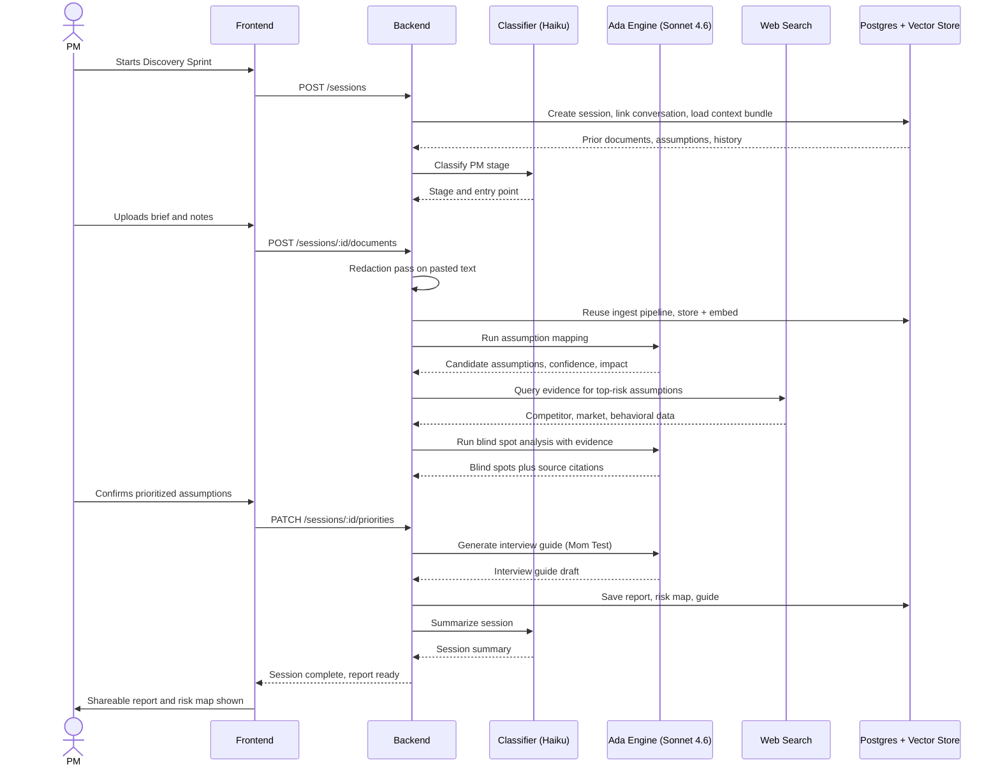
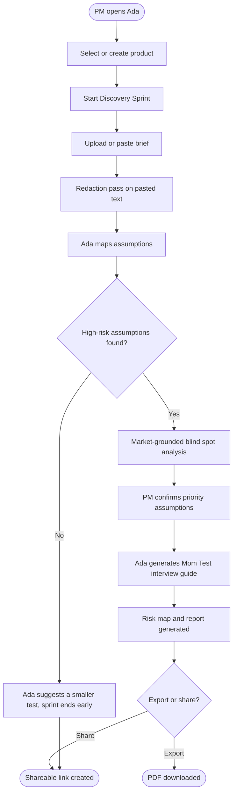

PRD generated by Deus AI Feature Breakdown
Feature: Ada Discovery Coach (v2 Full Build, corrected) | Date: 2026-07-03 | Status: Draft

---

## Ada Discovery Coach (v2 Full Build)

**Status:** Draft
**Author:** Mo
**Date:** 2026-07-03
**Supersedes:** ada-discovery-coach-v1.md (2026-07-03). This version corrects
five build-breaking assumptions in v1. Every change from v1 is marked with a
**[CHANGED FROM v1]** note so it can be diffed. Read those first if you have v1
open beside this.

### What changed from v1, at a glance

1. **Production model routing is three-tier, not Fable 5.** v1 ran the Ada
   Engine on Fable 5 for every real session. That is a runtime cost mistake.
   Fable 5 builds this app; it never runs in production. Runtime uses Haiku for
   classification and summarization, Sonnet 4.6 for reasoning-heavy coaching.
2. **Reuse the existing document pipeline.** The database already has
   `documents`, `document_chunks` (with a working 1,536-dimension embedding
   column), and an `ingest` Edge Function. v1 read as if building this from
   scratch. Extend what exists; do not build a parallel pipeline.
3. **Reuse the existing conversation engine.** A Discovery Sprint session links
   to a row in the existing `conversations` table by foreign key. Do not invent
   a new session-message structure.
4. **Extend existing auth, do not rebuild it.** Supabase Auth with JWT and
   role-based routing already works. Scope new tables to the logged-in PM using
   the existing pattern.
5. **The redaction promise is now a real engineering task with an acceptance
   test.** v1 promised interviewee PII redaction in prose but had no task
   building it. It is now a named Backend task.

### Problem
Early-stage and aspiring PMs (product managers), bootcamp grads, career
switchers, and founding PMs at pre-seed startups have an idea, no formal
discovery training, and no team to pressure-test it with. They either skip
discovery and build the wrong thing, or lean on a generic AI chatbot that
forgets their product between sessions, answers from general knowledge instead
of real market evidence, and leaves them with a transcript instead of something
they can hand to a stakeholder.

### Solution
Ada is a standing AI coaching relationship, not a single-session tool. A PM
opens a guided Discovery Sprint, grounds it in their own brief and notes, and
Ada maps their assumptions, checks the riskiest ones against live web research,
runs Socratic blind spot analysis, and generates a Mom Test interview guide (a
customer interview method built around asking about past behavior instead of
hypothetical opinions, so answers cannot just flatter the PM's existing
belief). The sprint ends with a shareable report and a confidence-by-impact
risk map the PM can screenshot into a deck. Every session updates a running
ledger of what got validated, challenged, or abandoned, so Ada coaches
differently on a PM's tenth session than their first.

### Why Now
This is an internal build for Mo, using a time-boxed Fable 5 access window to
push Ada past its cohort scope into a full customer-discovery platform. It is a
learning and portfolio exercise, not a production launch. The build is
delegated to Fable 5 at high effort; the goal is to produce far more than could
be hand-built in the same window, then reverse-engineer and audit it afterward.

### Success Metrics
These are the product's eventual real-world metrics, kept from v1 for when Ada
does reach real users. They are not the success criteria for the build itself
(those live in the Run 1 and Run 2 goal statements).

| Metric | Baseline | Target | Timeline |
|--------|----------|--------|----------|
| Unique PMs who start at least one sprint (Adoption) | 0, pre-launch | 10 PMs | 30 days post any future launch |
| Sprint completion rate (Funnel) | Unmeasured, no completion tracking exists today | 40% | 30 days post any future launch |
| Sessions completed without an unhandled error (Health) | Unmeasured | 95%+ | 30 days post any future launch |
| Assumption-to-evidence conversion (Supporting) | Unmeasured | 80%+ | 30 days post any future launch |

### Out of Scope (v1)
- Enterprise PM teams with existing research ops functions.
- A cohort or bootcamp management view where a manager assigns and reviews.
- Billing and paid plans. This build runs on the platform's own Anthropic and
  OpenAI keys for a single user (Mo).
- Single sign-on, team accounts, and any permission model beyond one PM owning
  their own products.
- Native export to Notion, Linear, Jira, or Asana. The report is shareable as a
  link and a PDF; structured exports are a later candidate.
- A mobile native app. This is a responsive web app.
- Human coach handoff or a coach marketplace.

### Open Questions

**Must resolve before build starts**
- ~~Closed beta versus public signup.~~ **RESOLVED:** Neither. This is a
  single-user internal build for Mo. No signup flow, no email verification at
  scale, no abuse handling in this build.
- ~~Model routing between Fable 5 and a cheaper model.~~ **RESOLVED:** Three
  tiers. See Business Rules, model routing. Fable 5 is build-time only.
- ~~Web research: Claude native search versus a separate API.~~ **RESOLVED FOR
  THIS BUILD:** use the web search tool already available to the runtime model.
  A separate search API (Tavily, Exa) is a later optimization, not a build
  dependency.
- ~~Data retention and deletion policy for uploaded documents and pasted
  interview content.~~ **RESOLVED FOR THIS BUILD:** session-scoped uploads
  auto-purge with the conversation; the redaction pass (Backend task) strips PII
  from any pasted text before it enters the grounding context.

**Can decide during sprint**
- Exact visual styling of the confidence-by-impact risk map.
- Whether the "second product" moment gets special dashboard treatment.
- The exact heuristic Ada uses to detect "stuck after real interviews" versus
  "fresh idea." A first-pass classifier is fine to refine after real usage.

---

### Technical Flow

1. The PM logs into Ada (existing Supabase Auth) and selects an existing
   product or creates a new one.
2. The PM starts a new Discovery Sprint session for that product. The frontend
   calls POST /products/:id/sessions.
3. The backend creates a `sessions` row, **creates or links a `conversations`
   row by foreign key** [CHANGED FROM v1: reuse existing conversation engine],
   loads the product's context bundle (prior documents, prior assumption maps,
   prior session summaries) from Postgres and the existing vector store, and
   returns a session_id.
4. The backend calls the stage classifier (**Haiku** [CHANGED FROM v1: was
   Sonnet in v1, is Haiku here; this is a short classification task]) to assess
   the PM's stage from the intake message plus the context bundle, and decides
   the entry point: fresh idea versus mid-discovery and stuck.
5. The PM uploads or pastes a product brief and any existing notes. The frontend
   calls POST /sessions/:id/documents. **The backend runs the redaction pass on
   any pasted text** [CHANGED FROM v1: new step], then reuses the existing
   `ingest` pipeline [CHANGED FROM v1] to store the file, extract text, generate
   embeddings via OpenAI text-embedding-3-small, and update the session's
   grounding context. Uploads here are session-scoped and never enter the global
   document corpus.
6. The Ada Engine (**Sonnet 4.6** [CHANGED FROM v1: was Fable 5]) runs
   Assumption Mapping: it asks structured questions, extracts a candidate list
   of assumptions across desirability, viability, feasibility, and usability,
   and the backend writes them to the `assumptions` table with confidence and
   impact scores.
7. For each high-risk assumption, the backend triggers a market-grounding call.
   The Ada Engine (**Sonnet 4.6**) queries the web search tool for competitor
   moves, market data, and behavioral research, and the backend attaches
   source-cited evidence to the assumption record.
8. The Ada Engine (**Sonnet 4.6**) runs Blind Spot Analysis: Socratic
   questioning grounded in the retrieved evidence and the PM's own documents.
   The backend logs each blind spot against its source assumption.
9. The PM confirms the three to five riskiest assumptions. The backend flags
   those records as prioritized.
10. The Ada Engine (**Sonnet 4.6**) generates a Mom Test interview guide for the
    prioritized assumptions. The backend stores the guide as a versioned
    document linked to the session.
11. The backend compiles the Discovery Report (problem framing, assumption map,
    evidence summary, interview guide, risk map) and renders the
    confidence-by-impact visual as an image.
12. The frontend shows the completed session with a shareable report link and
    the risk map. The PM can export a PDF or copy a public share link.
13. The backend closes the session, generates a session summary (**Haiku**
    [CHANGED FROM v1: summarization is a Haiku task]), and updates the product's
    running validated / challenged / abandoned assumption ledger, so the next
    session opens with updated context.

Source of truth: the `sessions`, `assumptions`, and `documents` tables in
Postgres. The vector store is a derived index rebuilt from those tables and is
never itself the source of truth.

### Business Rules

**Model routing** [CHANGED FROM v1: this whole subsection is new]. Routing is
config-driven, not hardcoded per call site, so the split can change without a
redeploy. The three tiers:

- **Haiku (claude-haiku-4-5)** for cheap, mechanical, structured tasks: stage
  classification (fresh idea versus stuck), session summarization, and any
  simple find/fetch/format step. Short input, short structured output, no
  creative reasoning. This is the intern tier: fast, cheap, supervised by the
  structure of the task itself.
- **Sonnet 4.6 (claude-sonnet-4-6)** for the reasoning-heavy coaching calls:
  assumption mapping, blind spot analysis, market-grounding synthesis, and
  interview guide generation. This is where reasoning quality is visible in the
  output, so it earns the more capable model. Sonnet 4.6 specifically, not
  Sonnet 5, for cost reasons; revisit Sonnet 5 later.
- **Fable 5: build-time only. Never in production.** Fable 5 is the model used
  to build this application. No production runtime call ever routes to Fable 5
  or any Mythos-tier model.

**Access.** Single user (Mo) for this build. Every table scoped to the logged-in
PM via existing row-level security. No team or org tier.

**Valid inputs.** Uploaded documents accept PDF, DOCX (Word document), TXT, and
Markdown, capped at 20MB per file and 10 files per product. Pasted text fields
cap at 50,000 characters, shown live, to keep model context and token cost
predictable.

**Repeatable actions.** A PM can run unlimited Discovery Sprint sessions per
product and can create multiple products. Re-running a sprint on the same
product pulls in accumulated history.

**Config change after close.** If a PM edits an assumption's confidence or
impact after a session has closed, the risk map and report regenerate on
request, but the already-generated interview guide does not auto-regenerate. The
PM may be holding that guide in an actual interview; silently changing it under
them is worse than leaving it stale until they ask.

**Liability stance.** Ada states plainly, in the report itself, that
AI-generated market research and interview questions are a starting point the PM
should verify, not settled fact. Every evidence citation links to its source.

**External limits.** Anthropic API rate limits and per-token cost, web search
rate limits and per-query cost, and embedding cost that scales with upload
volume, bounded by the file size and count limits above.

### Post-Action Experience

| Outcome | Primary actor (PM) sees | Secondary actor sees |
|---------|-------------------------|----------------------|
| Success | The completed session view: shareable report link, risk map image, interview guide, and a "Start next sprint" call to action. | Not applicable |
| Failure | An inline error on the exact step that failed, with a "Retry this step" control. Everything completed before the failure is preserved. | Not applicable |
| Cancel / abandon | The session is saved as in progress. On next login, a "Resume sprint" card appears at the top of the product dashboard showing the last completed step. | Not applicable |

### Audit Trail

- **What we store:** session_id, product_id, pm_user_id, created/updated/
  completed timestamps, the stage classification result, assumption records
  (text, category, confidence, impact, status of validated / challenged /
  abandoned / untested), evidence citations (source URL, retrieval timestamp,
  query used), interview guide versions, document metadata (filename, upload
  timestamp, extracted text hash), and which model handled each call (Haiku or
  Sonnet 4.6) for cost tracing.
- **What we explicitly do NOT store:** any personally identifiable information
  (PII) belonging to the PM's own interview subjects. If a PM pastes real
  interview content, the redaction pass strips email addresses and flagged name
  patterns before that text enters the grounding context. Passwords are never
  stored in plaintext; auth uses Supabase's hashed credentials.
- **Retention:** session and assumption data is retained for the life of the
  account. Session-scoped uploaded documents auto-purge when their conversation
  is deleted and never enter the global corpus.
- **If a past action is reversed:** if a PM marks a previously validated
  assumption as abandoned after new evidence, the record keeps a full
  append-only status history, so the report reflects current state while the
  audit trail preserves what was true at each point. No notification fires;
  single-user action.

### Future Extensibility
A later version most likely adds a manager or bootcamp view. This schema
supports that without rework, since `sessions` and `products` are already scoped
to a single pm_user_id that a future org_id can wrap around. When writing the
Sonnet 4.6 system prompts for the Ada Engine, run them through the
fable5-prompting rulebook only if they will ever be swapped to a Mythos-tier
model; for Sonnet 4.6, standard prompting practice applies.

---

## User Flow

---

### Active Personas

- **PM** (Mo, for this build) creates products, runs sessions, uploads
  documents, reviews and shares reports. This is the whole product.
- **Admin** (also Mo, as operator) monitors Haiku and Sonnet spend and can
  suspend an account if usage spikes. No cohort management.
- **Interview subjects** are the PM's own; they never log into Ada and appear
  only as content referenced inside guides and reports, PII-redacted.

### User Stories

**Must Have (this build)**
- As a PM, I want to create a product and start a Discovery Sprint so I can begin
  pressure-testing a new idea in one place.
- As a PM, I want to upload or paste my brief and notes so Ada grounds its
  coaching in what I have already written, not generic advice.
- As a PM, I want Ada to map my idea into a list of scored assumptions so I can
  see which parts are riskiest before I build anything.
- As a PM, I want Ada to check my riskiest assumptions against live market and
  competitor evidence so I am challenged with data, not just clever questions.
- As a PM, I want Ada to generate a Mom Test interview guide for my prioritized
  assumptions so I walk into customer conversations asking questions that cannot
  just confirm what I already believe.
- As a PM, I want a shareable discovery report with a confidence-by-impact risk
  map so I can show a stakeholder or hiring manager evidence of my process.
- As a PM, I want Ada to remember my product across sessions so session ten
  builds on session one instead of starting over.
- As a PM, I want Ada to recognize whether I am starting fresh or already stuck
  so the coaching adjusts to where I actually am instead of running a fixed
  script.
- As a PM, I want to resume an in-progress sprint if I close the tab so I do not
  lose my place or my uploaded documents.

**Should Have (later)**
- As a PM, I want to bring a second product to Ada so the dashboard handles
  multiple products cleanly.
- As an Admin, I want visibility into per-account Haiku and Sonnet spend so I
  catch runaway usage before it becomes a real bill.

**Nice to Have (backlog)**
- Export a report to Notion or Linear.
- Invite a mentor or manager to view (not edit) a report.
- A cohort dashboard for a bootcamp or manager.

---

### Edge Cases

**Data and input**
- A file over 20MB or an unsupported format is rejected before storage with an
  inline error naming the limit and accepted formats.
- Pasted text over 50,000 characters shows a live count and blocks submission.
- An intake with no brief and no pasted text prompts Ada to ask a clarifying
  question instead of mapping assumptions against nothing.
- **[CHANGED FROM v1: new]** If the redaction pass detects PII it cannot
  confidently strip (an ambiguous name-like token), it flags the passage to the
  PM rather than silently passing it through or silently deleting it.

**State and permissions**
- A PM with no prior products sees a "Create your first product" empty state.
- Starting a second concurrent sprint on a product that already has one in
  progress routes to resume the existing session.
- A suspended account sees a clear message and cannot start new sessions.

**Async and timing**
- If a Sonnet 4.6 call for assumption mapping or blind spot analysis times out
  or fails, the PM sees an inline "retry this step" control, and prior work is
  preserved.
- Navigating away mid-session saves it as in progress with a "Resume sprint"
  card on next login.
- The same session open in two tabs rejects the second submission with a
  "refresh to continue" message rather than overwriting.

**Integrations**
- If web search is down or rate-limited, blind spot analysis proceeds using only
  the PM's own documents and prior history, and the report labels which claims
  are evidence-backed versus Socratic-only.
- If web search returns nothing relevant, Ada says so rather than manufacturing
  a citation.
- If a model response cannot be parsed into the expected structure, the backend
  logs the raw response and shows a retry option, never a broken partial render.

**Lifecycle**
- Deleting an uploaded document after a completed session leaves that session's
  report and guide intact (artifacts are snapshotted at creation). Only future
  sessions lose access.
- **[CHANGED FROM v1]** Session-scoped uploads auto-purge with their
  conversation; they were never in the global corpus to begin with.

---

### Analytics Events

| Event Name | Trigger | Key Properties |
|------------|---------|---------------|
| product_created | PM creates a product | pm_user_id, product_id |
| sprint_started | PM starts a session | pm_user_id, product_id, session_id, is_first_sprint |
| document_uploaded | PM uploads or pastes grounding content | pm_user_id, session_id, doc_type, doc_size_bytes |
| pii_redacted | Redaction pass strips or flags PII | session_id, redaction_count, flagged_count |
| assumptions_mapped | Ada completes assumption mapping | session_id, assumption_count, model_used |
| evidence_retrieved | Web search grounding completes | session_id, assumption_id, source_count |
| blind_spots_surfaced | Ada completes blind spot analysis | session_id, blind_spot_count, model_used |
| priorities_confirmed | PM confirms prioritized assumptions | session_id, prioritized_count |
| interview_guide_generated | Ada generates the guide | session_id, question_count, model_used |
| sprint_completed | Session reaches completed report state | session_id, duration_seconds, steps_retried |
| sprint_abandoned | PM exits before completion | session_id, last_step_completed |
| report_viewed | PM or share-link recipient opens a report | session_id, viewer_type |
| report_shared | PM creates or copies a share link | session_id, share_method |
| error_encountered | Any error shown to the PM | pm_user_id, session_id, error_code, step |

[CHANGED FROM v1: added pii_redacted event so the redaction pass is observable,
not just asserted.]

---

### QA Checklist

**Functional**
- Happy path works end-to-end for a brand-new PM with no prior products.
- Happy path works end-to-end for a PM with two or more prior sessions on the
  same product, confirming the memory ledger changes the coaching.
- All Must-Have user stories are verifiable against a real running build.

**Edge cases**
- Each edge case above has a matching test scenario.
- Error states show the correct message, never a raw stack trace or unparsed
  model response.
- Loading states appear for any step over 300 milliseconds, especially model
  calls.

**AI output and model behavior**
- Assumption mapping output always parses into valid structured records;
  malformed output triggers the retry path, not a crash.
- Every blind-spot claim labeled evidence-backed has a real, working source
  link.
- The interview guide never includes a leading or hypothetical-opinion question.
- **[CHANGED FROM v1]** The redaction pass is verified by a test that pastes a
  sample transcript containing names and emails and confirms none reach the
  embedding call.
- **[CHANGED FROM v1]** Every model call logs which tier handled it (Haiku or
  Sonnet 4.6); no production call ever logs Fable 5 or a Mythos-tier model.

**Cross-browser and device**
- Works on Chrome, Safari, and Firefox, latest versions.
- Works on a 375px mobile viewport.
- No layout breaks at 1280px and 1920px.

**Accessibility**
- All interactive elements keyboard-navigable.
- Logical focus order through the multi-step sprint flow.
- Error messages tied to fields with aria-describedby.
- Color is never the only signal on the risk map; labels back up color.

**Performance**
- Non-AI page loads render under 2 seconds.
- No layout shift on load.
- Model steps show a clear in-progress state, never an unexplained pause.

---

### Engineering Tasks

Sizes: S / M / L / XL. Grouped by the two build runs so the checkpoint is clean.

#### Run 1: Data and backbone (the walk-away build, xhigh effort)

**Backend**
- Extend existing auth to scope products and sessions to the logged-in PM — S
  - Acceptance: a logged-in PM can only see their own products and sessions.
- products table plus CRUD endpoints — S
  - Acceptance: a PM can create, list, rename, and delete a product they own.
- sessions table plus a state machine for in_progress, completed, abandoned,
  with a foreign key to the existing conversations table — M
  - Acceptance: starting a session creates a sessions row and a linked
    conversations row; state transitions match the Technical Flow.
- Redaction pass: strip email addresses and flagged name patterns from pasted
  text before it enters the grounding context — M
  - Acceptance: a test pasting a sample transcript with names and emails
    confirms no PII reaches the embedding call; ambiguous tokens are flagged to
    the PM, not silently dropped.
- Extend the existing ingest pipeline to be session-scoped — M
  - Acceptance: a document uploaded in a session is retrievable by semantic
    search within that session only and never appears in the global corpus.
- assumptions table plus an append-only status history log — M
  - Acceptance: changing an assumption's status preserves every prior status
    with a timestamp.
- Sonnet 4.6 integration wrapper for assumption mapping — L
  - Acceptance: a valid intake produces structured assumptions with confidence
    and impact scores, or a clean retry path on malformed output.
- Haiku stage classifier — M
  - Acceptance: intake classification returns "fresh idea" or "stuck" with a
    confidence score in under 5 seconds.
- Cost and usage tracking middleware — M
  - Acceptance: every model call logs tier (Haiku or Sonnet 4.6), token count,
    and cost against the session; no call logs a Mythos-tier model.

**Data / Analytics**
- Write migrations for products, sessions, assumptions tables, all with
  owner-only RLS mirroring the existing conversations pattern — M
  - Acceptance: migrations run cleanly on a fresh database; a query proves one
    test user cannot read another user's rows in any new table.

**DevOps / Infra**
- Config-driven model routing (Haiku / Sonnet 4.6 per call type) — S
  - Acceptance: routing is config-driven, changeable without a redeploy; no
    route points at Fable 5 or any Mythos-tier model.
- Confirm ANTHROPIC_API_KEY and OpenAI embedding key present, documented in
  .env.example, never committed — S
  - Acceptance: both keys work and neither is in the repo.

**Build documentation (produced by the build agent itself)**
- Write a running build log in Markdown and DOCX as the run proceeds — S
  - Acceptance: at the checkpoint, a human-readable log exists stating what was
    built, what was decided and why, and anything that could not be verified.

#### Run 2: Surface (screens, risk map, report, sharing, high effort)

Written at the checkpoint, after Run 1 is inspected. Placeholder scope: the
market-grounding call, blind spot analysis, interview guide generation, the
report compilation and PDF export, the shareable public link, all frontend
screens (dashboard, intake, assumption review, blind spot review, priority
confirmation, guide display, risk map, completed report, resume flow), the full
analytics instrumentation, and the admin spend view.

---

**What to do next**
- Fire Run 1 with the loaded goal statement (written next), xhigh effort,
  committed to a new branch.
- At the checkpoint, read the build log (not the code) and confirm Run 1 built
  the backbone before scoping Run 2.
- Riskiest assumption to watch: that reusing the conversations table as the
  session backbone stays clean once real product/session context loads on top of
  it. If that seam tangles, it tangles here in Run 1, which is exactly why the
  checkpoint exists.
