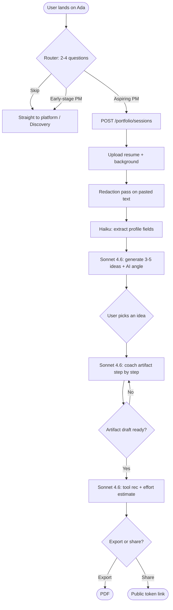
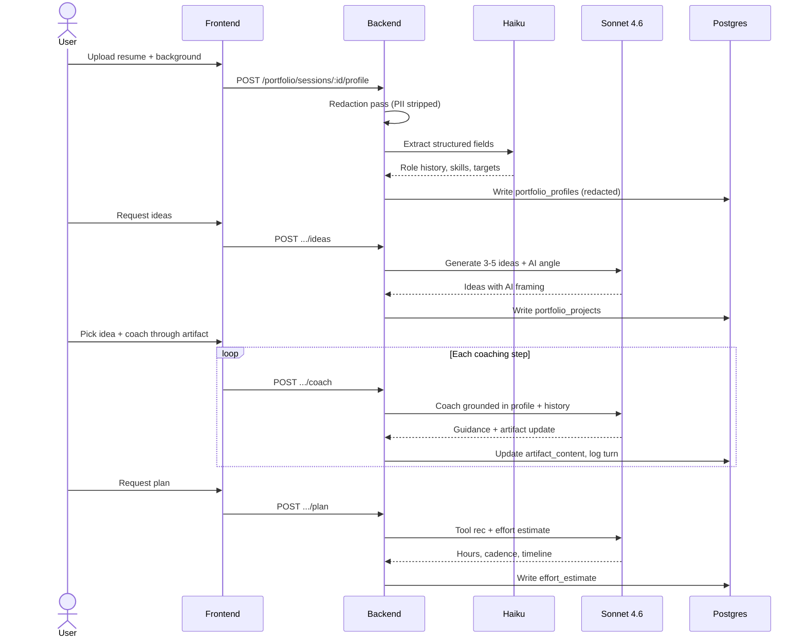
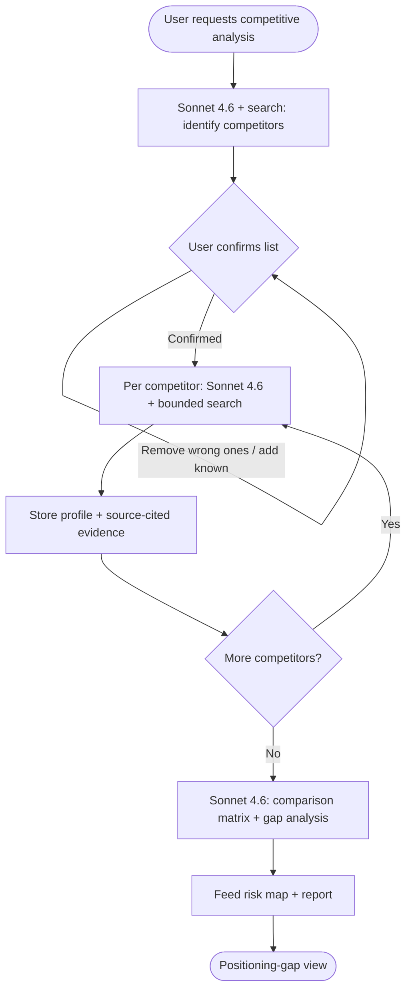

PRD v3 Addendum: JTBD, API Injection Map, Process Diagrams
Companion to ada-discovery-coach-v3.md | Date: 2026-07-05

This is the depth layer for v3: Jobs To Be Done, the API injection map,
and process diagrams. Read it alongside the main v3 PRD. Run 4 sections
are what Fable needs first; Run 5 sections are for the checkpoint.

===================================================================
JOBS TO BE DONE (JTBD)
===================================================================

JTBD framing: "When [situation], I want to [motivation], so I can
[expected outcome]." It describes the job the user is hiring the feature
to do, independent of the feature's shape.

--- RUN 4: Routing + Portfolio ---

JTBD-1 (Routing)
When I first land on Ada and I'm not sure it's built for someone like me,
I want to be pointed to the part that fits my actual situation, so I can
start getting value in under a minute instead of guessing which button is
for me.

JTBD-2 (Portfolio, the core one)
When I'm trying to break into product management without a PM title yet,
I want to produce a portfolio artifact that proves I can think like a PM,
so I can get past resume screens that filter out people with no PM
experience.

JTBD-3 (Portfolio grounding)
When I ask for portfolio help, I want the advice grounded in my real
background and target roles, so I get project ideas I can actually
execute and defend in an interview, not generic filler.

JTBD-4 (Effort honesty)
When I'm committing free time to build a portfolio piece around a job,
I want an honest estimate of the hours and timeline, so I can decide if
it fits my life before I start and abandon it half-finished.

JTBD-5 (AI-native lens)
When I'm building a portfolio to land an AI PM role specifically, I want
every artifact to show I understand where AI fits in a product, so I
don't look like a traditional PM applying to AI jobs.

--- RUN 5: Market + Competitive Intelligence ---

JTBD-6 (Market brief)
When I'm about to commit to a product direction, I want a sourced read on
whether the market is real and growing, so I can size the opportunity with
evidence before I sink weeks into it.

JTBD-7 (Competitor identification)
When I think I have a new idea, I want to know who's already doing it, so
I can find out fast whether I'm entering a crowded space or a real gap.

JTBD-8 (Positioning gap)
When I know my competitors, I want to see where the landscape is unserved,
so I can position my product where it can actually win instead of head-on
against an incumbent.

JTBD-9 (Trustable-in-a-deck intel)
When I put market or competitor claims in front of a stakeholder or hiring
manager, I want every claim dated and source-linked, so my credibility
survives someone clicking the source.

===================================================================
API INJECTION MAP
===================================================================

"API injection point" = a place where the backend calls an external model
API or tool, i.e. where token cost and latency enter the system. Each row:
endpoint, HTTP method, what triggers it, which model tier, whether it hits
the web_search tool, and what it reads/writes. This is the cost-and-
latency surface Fable must instrument to model_usage.

--- RUN 4 endpoints ---

1. POST /portfolio/route
   Trigger: user answers router questions.
   Model: Haiku (classification only). Web search: no.
   Reads: router answers. Writes: nothing persistent (routing decision
   returned to client). Cost: minimal.

2. POST /portfolio/sessions
   Trigger: aspiring PM enters the portfolio track.
   Model: none on creation. Web search: no.
   Reads: user_id. Writes: portfolio_profiles row (empty shell), linked
   conversations row (reuse existing engine).

3. POST /portfolio/sessions/:id/profile
   Trigger: user uploads resume + background.
   Model: Haiku (extract structured fields from resume text). Web search:
   no. PRE-STEP: existing redaction pass on any pasted text BEFORE storage
   or model call.
   Reads: uploaded text. Writes: portfolio_profiles (resume_text redacted,
   background, targets).

4. POST /portfolio/sessions/:id/ideas
   Trigger: profile complete, user requests ideas.
   Model: Sonnet 4.6 (generate 3-5 ideas, AI-native angle enforced).
   Web search: no (grounded in profile, not external data).
   Reads: portfolio_profiles bundle. Writes: portfolio_projects rows
   (one per idea, chosen=false).

5. PATCH /portfolio/projects/:id/choose
   Trigger: user picks an idea.
   Model: none. Web search: no.
   Writes: portfolio_projects.chosen=true for one, others stay false.

6. POST /portfolio/projects/:id/coach
   Trigger: each step of artifact creation (multi-turn).
   Model: Sonnet 4.6 (coaching, grounded in profile + prior turns).
   Web search: no. Reads: project + profile + conversation history.
   Writes: assistant turns to conversations; artifact_content (jsonb)
   updated incrementally.

7. POST /portfolio/projects/:id/plan
   Trigger: artifact reaches draft; user requests tools + effort estimate.
   Model: Sonnet 4.6 (tool rec + hours/cadence/timeline). Web search: no.
   Writes: portfolio_projects.effort_estimate (jsonb).

8. GET /portfolio/projects/:id/export (PDF) and POST .../share (token)
   Model: none. Reuses existing report-pdf and report-public token paths.

--- RUN 5 endpoints ---

9. POST /products/:id/market-intel
   Trigger: user requests a market brief.
   Model: Sonnet 4.6 (plan search angles, then synthesize).
   Web search: YES, bounded (default cap 15 searches, config-driven),
   via existing callClaudeWithWebSearch wrapper + bounded pause_turn loop.
   Reads: product context. Writes: market_briefs (snapshot),
   market_evidence (one row per real returned URL; CHECK enforces url).
   Cost: highest per-call surface in the platform; must record
   web_search_requests to model_usage.

10. POST /products/:id/competitive-intel/identify
    Trigger: user requests competitive analysis (step 1).
    Model: Sonnet 4.6. Web search: YES, bounded.
    Reads: product context. Writes: competitors rows (confirmed=false).
    Returns candidate list for user confirmation BEFORE deep profiling
    (this gate prevents wasting the search budget on wrong targets).

11. PATCH /products/:id/competitive-intel/confirm
    Trigger: user confirms/adds/removes competitors.
    Model: none. Writes: competitors.confirmed flags.

12. POST /competitors/:id/profile
    Trigger: per confirmed competitor (one call each, retry granularity).
    Model: Sonnet 4.6. Web search: YES, bounded per competitor.
    Writes: competitors (positioning, pricing_signal, feature_notes,
    recent_moves), competitor_evidence (CHECK: source_url required).

13. POST /products/:id/competitive-intel/gap
    Trigger: profiling complete, user requests gap analysis.
    Model: Sonnet 4.6 (comparison matrix + positioning-gap synthesis).
    Web search: no (reasons over already-stored evidence).
    Writes: gap analysis into the product's report snapshot.

INJECTION-MAP RULES (apply to every row above):
- Every model call records tier + tokens + cost to model_usage.
- Every web_search call records web_search_requests count and folds
  search cost into cost_usd (Run 2 pattern).
- No row may route to Fable/Mythos; existing CHECK constraint enforces.
- Every _evidence table write requires a real source_url (CHECK), so a
  fabricated citation is physically unstorable.

===================================================================
PROCESS DIAGRAMS
===================================================================

--- RUN 4: Router + Portfolio flow ---



--- RUN 4: Portfolio coaching sequence (who calls whom) ---



--- RUN 5: Competitive intelligence flow (note the confirm gate) ---



--- RUN 5: Market intelligence sequence (cost-bounded) ---

```mermaid
sequenceDiagram
  actor User
  participant FE as Frontend
  participant BE as Backend
  participant SN as Sonnet 4.6
  participant WS as Web Search
  participant DB as Postgres
  User->>FE: Request market brief
  FE->>BE: POST /products/:id/market-intel
  BE->>SN: Plan search angles from product context
  SN-->>BE: Bounded search plan (<= cap)
  loop Each angle, until search cap
    BE->>WS: Execute search
    WS-->>BE: Real results with URLs
  end
  BE->>SN: Synthesize sourced brief
  SN-->>BE: Brief; only real URLs as evidence
  BE->>DB: Write market_briefs + market_evidence (CHECK: url required)
  BE->>DB: Record web_search_requests + cost to model_usage
  BE-->>FE: Dated, refreshable brief
```

===================================================================
CHECKPOINT NOTE
===================================================================
Run 4 uses diagrams and endpoints 1-8, JTBD 1-5. Run 5 (endpoints 9-13,
JTBD 6-9) is scoped at the checkpoint after Run 4's PR is open and its
build log is read. Riskiest Run 4 seam remains the router serving both
personas without the aspiring-PM track feeling bolted on; riskiest Run 5
seam is the search-budget cap actually holding under a real multi-
competitor run.
