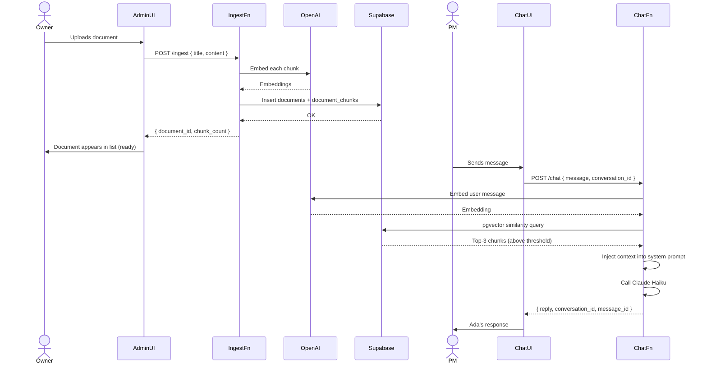
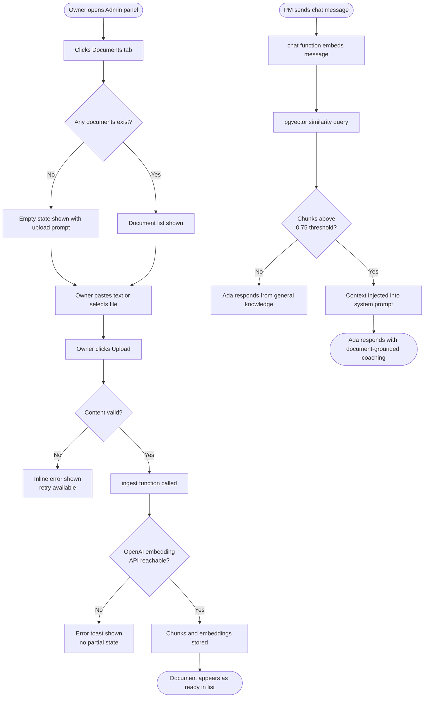

PRD generated by Ada Coach Feature Breakdown
Feature: Documents RAG | Date: 2026-04-25 | Status: Draft

---

## Documents RAG — Knowledge-Grounded Coaching

**Status:** Draft
**Author:** Mo
**Date:** 2026-04-25

### Problem

Ada coaches from Claude's general knowledge. A PM can describe their product in chat, but Ada has no access to the actual artifact — the product brief, interview notes, or assumption map the PM is working from. The coaching is useful but generic. Ada asks the same structural questions regardless of what the PM has already documented.

RAG changes this. When a PM's product brief is in the knowledge base, Ada can reference it directly: "In your brief you listed three user segments — have you validated all three, or are some still assumptions?" That's the coaching shift this feature enables.

### Solution

We are building a two-phase pipeline: upload (Phase 1, already shipped) and retrieve-and-inject (Phase 2, this PRD). Phase 1 gave the owner a file upload UI and a `documents` table with Supabase Storage. Phase 2 adds chunking, embedding, and retrieval — so that when a PM sends a chat message, Ada pulls the most relevant passages from uploaded documents and grounds her response in them.

### Why Now

Phase 1 is live. The storage bucket, the `documents` table, and the upload UI are deployed. Phase 2 is the only remaining work before the feature delivers coaching value. Deferring further means uploaded documents sit in storage doing nothing.

### Success Metrics

| Metric | Baseline | Target | Timeline |
|--------|----------|--------|----------|
| Documents processed to `ready` status | 0 | 100% of uploads within 60s | 30 days post-launch |
| Chat turns with retrieval triggered | 0% | ≥ 40% of turns (when docs exist) | 30 days post-launch |
| Retrieval error rate (embedding or query failure) | n/a | < 2% of chat turns | 30 days post-launch |
| Owner document upload success rate | n/a | ≥ 95% of upload attempts | 30 days post-launch |

### Out of Scope (v1)

- Per-user document uploads (owner-only for now)
- PDF parsing or structured extraction (plain text only)
- URL ingestion or live document sync
- Source citation display in the chat UI
- Streaming responses
- Per-conversation document scoping (global retrieval only)
- Anthropic embeddings API (not available yet; using OpenAI `text-embedding-3-small`)

### Open Questions

**Must resolve before build starts**
- Is pgvector enabled on the production Supabase project? Run `supabase extensions list` and confirm before writing the `document_chunks` migration.
- Does a source document set exist, or does Mo need to author the initial knowledge base content? Minimum viable set: one JTBD primer and one assumption-mapping guide.

**Can decide during sprint**
- Token budget for injected context: 4,000 tokens proposed. Confirm this leaves adequate headroom for Ada's 2–4 sentence responses at Haiku's context window.
- Similarity threshold for retrieval: 0.75 proposed. Adjust based on test results — too high means sparse retrieval, too low means irrelevant noise.
- Whether to expose `chunk_count` in the admin documents list (nice-to-have once Phase 2 lands).

---

## Step 1.3 — Detailed Product Decisions

### Technical Flow

**Upload and Ingest (triggered by owner in admin panel)**

1. Owner selects a file or pastes text in the admin Documents tab and submits the form.
2. Frontend calls `POST /functions/v1/ingest` with `{ title, content, doc_type? }` and the user's JWT.
3. `ingest` function validates the JWT via `requireUser()` and confirms the caller has role `owner`. Returns 403 if not.
4. Function validates that `content` is non-empty and under the size limit. Returns 400 if invalid.
5. Function calls OpenAI Embeddings API (`text-embedding-3-small`) on each chunk (300-word chunks, 50-word overlap, split on sentence boundaries). If the API call fails, the function returns 500 and writes nothing.
6. Function inserts one row into `documents` (status `processing`) and all chunk rows into `document_chunks` (with embeddings) in a single transaction. Updates `documents.status` to `ready` and `chunk_count` to the number of chunks on success, or `error` on failure.
7. Function returns `{ document_id, chunk_count, char_count }`.
8. Frontend displays the new document in the list with status `ready` and chunk count.

**Retrieval (transparent to the PM, triggered on every chat turn)**

1. PM sends a message in chat. Frontend calls `POST /functions/v1/chat` as normal.
2. `chat` function embeds the user's message using `text-embedding-3-small`.
3. Function queries `document_chunks` for the top-3 nearest chunks by cosine similarity using pgvector's `<=>` operator.
4. Chunks with similarity score ≥ 0.75 are included. Chunks below the threshold are dropped.
5. If qualifying chunks exist, function prepends a `Documents` context block to the system prompt. Total injected context is capped at 4,000 tokens.
6. Function calls Claude (Haiku) with the augmented system prompt. The request and response shapes are unchanged.
7. PM receives Ada's reply. Ada may reference document content; the source is invisible to the PM in v1.

### Business Rules

- Only users with `role = 'owner'` can upload or delete documents. Admin-role users can view the document list but cannot upload.
- Accepted file types: `text/plain` only for the ingest function (PDF parsing is out of scope). Storage bucket also accepts `application/pdf` for future use, but the ingest function rejects PDF content until a parser is added.
- Maximum file size: 50 MB (enforced at the storage bucket level).
- Chunking: 300-word target, 50-word overlap, split on sentence boundaries. A chunk must be at least 50 words; shorter trailing chunks are merged with the previous.
- Upload is repeatable. Uploading the same file twice creates two independent document records and two sets of chunks. The owner is responsible for deduplication.
- Deleting a document cascades to all its `document_chunks` rows. This is enforced by the `ON DELETE CASCADE` FK constraint — no orphan chunks.
- Retrieval is global. All `ready` documents are in scope for every chat turn. There is no per-conversation or per-user scoping in v1.
- The OpenAI Embeddings API is an external dependency. It is billed per token. Ingesting one 5,000-word document produces roughly 2,500 input tokens for embeddings — a negligible cost at current pricing, but it should be monitored.

### Post-Action Experience

| Outcome | Owner sees | PM sees |
|---------|--------------------|-------------------------------|
| Successful upload | Document appears in list with status `ready`, chunk count, and upload date within 3 seconds | No change — retrieval happens silently in chat |
| Upload with empty content | Inline error: "Document content is required" | Not applicable |
| Embedding API failure during ingest | Error toast: "Upload failed — please try again." Document does not appear in list. No partial state. | Not applicable |
| Successful retrieval in chat | Not applicable | Ada's response may reference the document; no visual indicator in v1 |
| No chunks above threshold (low similarity) | Not applicable | Ada responds from general knowledge; chat works normally |
| No documents uploaded | Not applicable | Chat works normally; no retrieval attempted |
| Document deletion | Document disappears from list immediately; chunk count reflects 0 | Not applicable |
| Document still processing | Status badge shows `processing`; chunk count is empty | Not applicable |

### Audit Trail

- What we store: `documents` rows (id, user_id, filename, file_path, content_text, created_at, status, chunk_count); `document_chunks` rows (id, document_id, chunk_index, chunk_text, embedding, created_at)
- What we explicitly do NOT store: the PM's chat messages are not written to `document_chunks`; we do not log which chunks were retrieved per turn in v1
- Retention: Documents and chunks persist until the owner explicitly deletes them. No automated expiry.
- If a document is deleted after retrieval has already occurred: the deletion is clean (cascade). Past chat messages that referenced the document's content are unaffected — the response text is already persisted in `messages`.

### Future Extensibility

v2 will likely add per-conversation document scoping (a PM selects which documents are in scope for a session) and source citation display in the chat UI — the current `document_chunks` schema already carries `chunk_index` and `document_id`, so both additions are additive with no schema changes.

---

## User Flow

---

## User Stories

### Active Personas

- **Owner (Mo)** — uploads documents that seed Ada's knowledge base, manages the document library
- **PM** — benefits from grounded coaching without any direct interaction with the RAG system
- ~~Admin~~ — can view document list but does not upload or configure retrieval in v1

### User Stories

**Must Have (MVP)**
- As an owner, I want to upload a plain-text document so that Ada can reference it when coaching PMs.
- As an owner, I want to see a list of uploaded documents with their status and chunk count so that I know what's in Ada's knowledge base.
- As an owner, I want to delete a document so that outdated or incorrect content is removed from retrieval.
- As a PM, I want Ada to reference my product context when I describe it in a document so that her coaching is specific to my situation.
- As a PM, I want chat to work normally even when no relevant documents exist so that a sparse knowledge base doesn't degrade my session.

**Should Have (v1.1)**
- As an owner, I want to see a `processing` status while a large document is being chunked so that I know the upload is in progress.
- As a PM, I want Ada to tell me which document she's referencing so that I can verify the source (citation display).

**Nice to Have (backlog)**
- As a PM, I want to scope a coaching session to specific documents so that Ada only draws from context relevant to today's product.
- As an owner, I want to upload a PDF and have Ada parse it so that I don't need to copy-paste long documents.
- As an owner, I want to see which documents are retrieved most often so that I can prioritize what to keep up to date.

---

## Edge Cases

**Data & Input**
- If the owner submits empty content, the ingest function returns 400 and the upload form shows an inline error explaining the field is required.
- If the uploaded content exceeds the 50 MB storage limit, the Supabase Storage layer rejects it before the ingest function is called, and the frontend shows an upload-failed message.
- If the document produces zero chunks after splitting (e.g., a document shorter than 50 words), the ingest function returns a 400 error and writes nothing to the database.
- If the same file is uploaded twice, two independent document records are created. The owner sees duplicate titles in the list and is responsible for deleting the older one.

**State & Permissions**
- If an admin-role user (not owner) attempts to call `/ingest`, the function returns 403. The Documents tab is visible to admins, but the upload control is hidden for non-owner roles.
- If a document is in `processing` status when the owner navigates to the Documents tab, it appears with a processing badge. If processing fails, it transitions to `error` and the owner sees an error badge with no chunk count.
- If a document is deleted while a chat turn is mid-flight and has already retrieved that document's chunks, the turn completes normally — the chunks are already in memory. Future turns will no longer retrieve from that document.

**Async & Timing**
- If the OpenAI Embeddings API is unavailable during ingest, the function returns 500 and writes nothing. The owner sees a failure toast and can retry the upload.
- If the OpenAI API is unavailable during retrieval in chat, the `chat` function catches the error, skips retrieval, and proceeds with no document context. Ada responds from general knowledge. The PM sees no error.
- If the pgvector similarity query times out, the same graceful degradation applies — chat proceeds without context injection.

**Integrations**
- If the OpenAI Embeddings API returns an unexpected response shape, the ingest function treats it as a failure: 500, no partial state, error toast for the owner.
- If the pgvector index does not yet exist (e.g., migration not applied), queries fall back to a sequential scan. Performance degrades but correctness is maintained. This should not happen in production.

**Lifecycle**
- If the injected context block would push the system prompt over 4,000 tokens, chunks are truncated starting from the lowest-similarity result until the budget is met.
- If a document's embeddings were generated with a different model dimension than the current retrieval model, the similarity query produces meaningless results. This cannot happen in v1 (single model: `text-embedding-3-small`, 1536-dim), but must be guarded if the model is ever changed.
- If Ada Coach's Supabase project is paused and the storage bucket becomes inaccessible, ingested text is still available in `documents.content_text` (stored at ingest time). No data loss.

---

## Analytics Events

| Event Name | Trigger | Key Properties |
|------------|---------|---------------|
| document_uploaded | Owner submits a document and ingest returns success | user_id, doc_type, char_count, chunk_count |
| document_upload_failed | Ingest returns an error | user_id, error_code, doc_type |
| document_deleted | Owner deletes a document | user_id, document_id, chunk_count |
| retrieval_triggered | Chat turn produces ≥ 1 chunk above similarity threshold | user_id, conversation_id, chunk_count_injected, top_similarity_score |
| retrieval_skipped | Chat turn finds no chunks above threshold | user_id, conversation_id, reason (no_docs or below_threshold) |
| retrieval_failed | Embedding or pgvector query errors during a chat turn | user_id, conversation_id, error_code |

---

## QA Checklist

**Functional**
- T-01: Uploading a 1,000-word document produces ≥ 3 chunks, each ≤ 350 words
- T-02: Each chunk has a non-null embedding of dimension 1536
- T-03: Deleting a document removes all its `document_chunks` rows
- T-04: Uploading empty content returns 400 with `{ error: "Document content is required" }`
- T-05: OpenAI API failure during ingest returns 500 and writes nothing to the DB
- T-06: A message about "task management for freelancers" retrieves chunks from a relevant document; unrelated documents return no results
- T-07: When no documents exist, chat returns a valid Ada response with no errors
- T-08: Chunks below 0.75 similarity are not injected into the prompt
- T-09: Injected context does not exceed 4,000 tokens in the system prompt
- T-10: Document list shows title, status badge, chunk count, and upload date
- T-11: Uploaded document appears in the list within 3 seconds of successful ingest
- T-12: Deleting a document removes it from the list immediately

**Edge Cases**
- Non-owner auth token receives 403 from `/ingest`
- Zero-chunk document produces a 400 with no DB writes
- OpenAI API timeout during retrieval falls back gracefully — chat returns a response

**Cross-browser / Device**
- Upload and document list work on Chrome, Safari, Firefox (latest)
- Document list renders correctly on mobile viewport (375px wide)

**Accessibility**
- Upload form fields are keyboard-navigable
- Status badges use text labels, not color alone

**Performance**
- Ingest of a 5,000-word document completes in under 15 seconds
- Chat turn with retrieval adds no more than 1 second of additional latency vs. baseline

**Analytics**
- `document_uploaded` fires after successful ingest response
- `retrieval_triggered` fires on every chat turn where chunks are injected
- No duplicate events on a single chat turn

---

## Engineering Tasks

**Backend**
- Add `document_chunks` migration with pgvector extension and ivfflat index — M
  - Acceptance: `document_chunks` table exists in production with `embedding VECTOR(1536)` column and `idx_chunks_embedding` index
- Implement `ingest` Edge Function: validate auth (owner-only), chunk content, call OpenAI embeddings, persist documents + chunks atomically — L
  - Acceptance: T-01 through T-05 pass against the deployed function
- Add shared chunker utility in `supabase/functions/_shared/chunker.ts` (300-word chunks, 50-word overlap, sentence-boundary split) — M
  - Acceptance: Unit tests for T-01 pass in Deno
- Add retrieval logic to `chat` function: embed user message, pgvector query, threshold filter, context injection, token budget cap — M
  - Acceptance: T-06 through T-09 pass against the deployed function
- Add `OPENAI_API_KEY` to Supabase secrets and document the new dependency in CLAUDE.md — S
  - Acceptance: Key is set, ingest function returns 200 in staging

**Frontend**
- Add upload form to the Documents tab in `/admin`: file input (text/plain) + paste textarea, title field, doc_type selector, submit button (owner-only) — M
  - Acceptance: Owner can upload a document end-to-end; non-owner sees the tab but not the upload form
- Update Documents tab list to show status badge (`processing`, `ready`, `error`), chunk count, and upload date — S
  - Acceptance: All fields render correctly for documents in each status

**Data / Analytics**
- Instrument `document_uploaded`, `document_upload_failed`, `document_deleted`, `retrieval_triggered`, `retrieval_skipped`, `retrieval_failed` — S
  - Acceptance: All six events appear in analytics on a test run

**DevOps / Infra**
- Confirm pgvector is enabled on the production Supabase project before writing the migration — S
  - Acceptance: `SELECT * FROM pg_extension WHERE extname = 'vector'` returns a row
- Set `OPENAI_API_KEY` in Supabase secrets for production and staging — S
  - Acceptance: Secret is set; ingest returns 200 in both environments

**QA**
- Write Vitest/Deno test scenarios covering T-01 through T-12 — M
  - Acceptance: All tests pass in CI
- Regression test chat without documents to confirm graceful degradation — S
  - Acceptance: T-07 passes; no errors in chat function logs when `document_chunks` is empty
